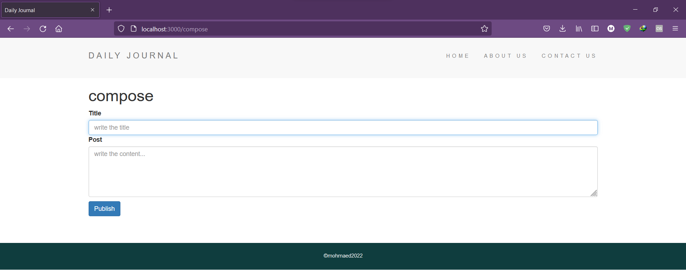
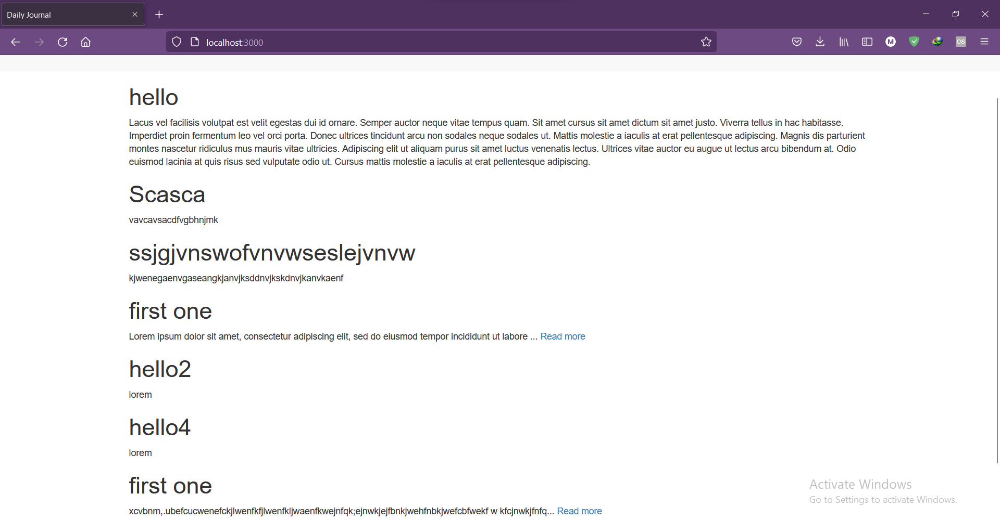
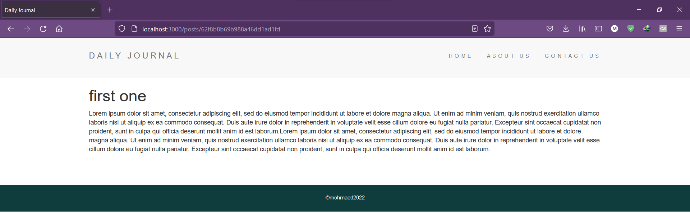

# blog-website
## an interactive blog website that helps you make a diary to keep the good memories!

you need to have node js and mongodb installed for it to be properly functioning
## Instructions
- download the files in the folder  
- open any cli and type "mongod"
- open new cli tab and make sure you're in the same folder of the project (use pwd to know the directory you're in)
- type "npm i" and let it install packages
- type "node app.js"
- go to "/compose" to write a new article
- browse your articles that is saved in the DB!

## Demo

